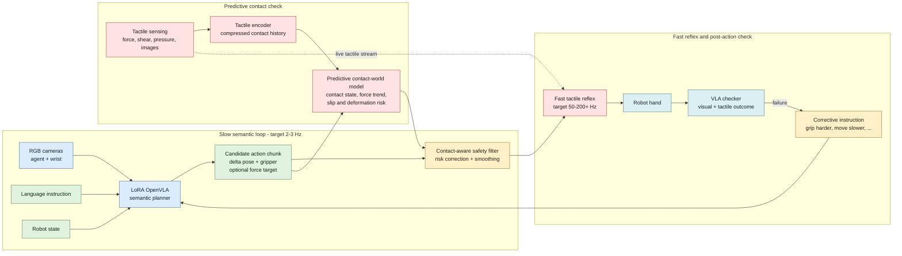

# Force-OpenVLA

**A force-aware, tactile extension for vision-language-action robot control.**

Force-OpenVLA is the research codebase for my MSc thesis on making
vision-language-action (VLA) policies safer and more responsive during physical
contact. The project combines OpenVLA-style semantic planning with tactile
prediction, contact-aware action filtering, and a fast reflex loop for dexterous
manipulation.

The central idea is simple: keep the general reasoning and language grounding of
a strong pretrained VLA, but do not ask the large model to handle every contact
event itself. A slower semantic policy proposes an action chunk, while a smaller
tactile system predicts contact outcomes and corrects risky actions before and
during execution.

> **Research question:** How can a general-purpose VLA preserve its semantic
> capabilities while gaining the fast, force-aware behavior required for contact
> tasks such as slip prevention, fragile-object grasping, thin-object pickup, and
> insertion?

## Motivation

Recent VLA models can adapt large pretrained vision-language backbones to robot
control, but camera observations alone cannot directly measure local force,
texture, contact pressure, micro-slip, or excessive squeezing. These signals are
often decisive once the robot closes its gripper or makes contact with the
environment.

Force-OpenVLA separates high-level reasoning from low-level contact response:

- **Slow semantic planning:** interpret RGB observations, language, and robot
  state, then propose a meaningful action chunk.
- **Predictive contact checking:** estimate future contact state, force trend,
  slip risk, and deformation risk before execution.
- **Fast tactile reflexes:** apply small contact corrections at a much higher rate
  than the main VLA can run.
- **Post-action supervision:** inspect visual and tactile outcomes and issue a
  corrective instruction when the action chunk fails.

## Fast-Slow Tactile VLA Architecture



The diagram is the complete research architecture. The current repository
implements the simulation, dataset, OpenVLA-OFT fine-tuning, action-chunk
prediction, and evaluation foundation. The tactile encoder, predictive
contact-world model, fast reflex controller, and physical GelSight Mini
validation are the next integration stage.

## Current Implementation

The latest pipeline is centered on a Franka Emika Panda pick-and-place task in
MuJoCo and the [`OpenVLA26_OFT.ipynb`](Simulation/OpenVLA26_OFT.ipynb) workflow.

- Franka Panda simulation with fixed third-person and wrist RGB cameras.
- Scripted expert collection for nominal and boundary demonstrations.
- RLDS/TFDS conversion with episode-level metadata and validation.
- OpenVLA-OFT fine-tuning with LoRA and continuous action regression.
- Measured joint and gripper proprioception supplied to the policy.
- Eight-step continuous Cartesian action chunks.
- Teacher-forced evaluation on untouched test demonstrations.
- Closed-loop out-of-distribution MuJoCo rollouts.
- Source-only GitHub synchronization for the latest notebook and helper scripts.

## D3 Dataset

The D3 dataset is a filtered, contact-relevant benchmark for the current
simulation stage. It contains successful nominal and boundary trajectories only;
recovery trajectories are deliberately excluded from both training and testing.

| Property | Value |
| --- | --- |
| Episodes | 800 total: 700 nominal, 100 boundary |
| Split | 720 train, 80 test |
| Control rate | 10 Hz |
| Primary image | Fixed third-person RGB, `480 x 640` |
| Secondary image | Wrist RGB, `256 x 256` |
| Proprioception | `[q1..q7, gripper_open_fraction]` |
| Action | `[dx, dy, dz, droll, dpitch, dyaw, gripper]` |
| Language | Per-step natural-language instruction |
| Metadata | Episode ID, seed, success, split, and trajectory mode |

Privileged simulator state such as cube and target poses is retained for
debugging and evaluation. It is not intended as a policy input.

## OpenVLA-OFT Configuration

The current D3 experiment uses:

| Setting | Value |
| --- | --- |
| Base policy | OpenVLA 7B with the OpenVLA-OFT training path |
| Objective | Continuous L1 regression with parallel decoding |
| Action horizon | 8 actions |
| Action dimension | 7 |
| Proprioception dimension | 8 |
| LoRA rank | 32 |
| Learning rate | `5e-4` |
| Full run | 50,000 optimizer steps |
| Checkpoint interval | 10,000 steps |
| Normalization | Train-only q01/q99 bounds |

The notebook includes a three-step smoke mode. Run that before any full training
job, especially after changing the dataset builder, OpenVLA-OFT checkout, CUDA
environment, or model configuration.

## Repository Layout

```text
force-openvla/
|-- README.md
|-- Simulation/
|   |-- OpenVLA26_OFT.ipynb
|   |-- prepare_panda_d3.py
|   |-- openvla_oft_d3_setup.py
|   |-- openvla_oft_d3_verify.py
|   |-- openvla_oft_heldout_visual_eval.py
|   `-- rlds_dataset_builder/panda_pickplace_d3/
|       |-- __init__.py
|       `-- panda_pickplace_d3_dataset_builder.py
|-- notebooks/
|   `-- main_experiment.ipynb
|-- physical_set/
|-- OpenVLA03.ipynb
|-- AGENTS.md
`-- .gitignore
```

### Key Files

| File | Role |
| --- | --- |
| [`Simulation/OpenVLA26_OFT.ipynb`](Simulation/OpenVLA26_OFT.ipynb) | End-to-end simulation, data, fine-tuning, and evaluation workflow |
| [`Simulation/prepare_panda_d3.py`](Simulation/prepare_panda_d3.py) | Builds and audits the nominal/boundary D3 raw view |
| [`Simulation/openvla_oft_d3_setup.py`](Simulation/openvla_oft_d3_setup.py) | Registers D3, joint proprioception, and Panda constants in OpenVLA-OFT |
| [`Simulation/openvla_oft_d3_verify.py`](Simulation/openvla_oft_d3_verify.py) | Verifies splits, shapes, normalization, transforms, and action chunks |
| [`Simulation/openvla_oft_heldout_visual_eval.py`](Simulation/openvla_oft_heldout_visual_eval.py) | Produces teacher-forced visual evaluation artifacts |
| [`Simulation/rlds_dataset_builder/panda_pickplace_d3/`](Simulation/rlds_dataset_builder/panda_pickplace_d3/) | Converts D3 demonstrations into RLDS/TFDS format |

Datasets, model weights, checkpoints, caches, and generated videos are not stored
in GitHub. They are large runtime artifacts and may also contain machine-specific
paths or credentials.

## Getting Started

### 1. Clone the Repository

```bash
git clone https://github.com/Fariborz-Eshraghi/force-openvla.git
cd force-openvla
```

### 2. Open the Main Notebook

Open [`Simulation/OpenVLA26_OFT.ipynb`](Simulation/OpenVLA26_OFT.ipynb).

The current workflow targets Linux, Python 3.11, and an NVIDIA CUDA environment.
Full OpenVLA-OFT training is configured for a 32 GB RTX 5090. Paths in the server
section must be adjusted if the project, dataset, Python environment, or
OpenVLA-OFT checkout lives elsewhere.

### 3. Run in Stages

1. Run Cell 1 for dependency, GPU, cache, and Git synchronization checks.
2. Run the simulation and collection cells through Cell E.
3. Run Cells F-K to build, register, and verify D3.
4. Set `TRAINING_MODE = "smoke"` and complete the three-step training check.
5. Change to `TRAINING_MODE = "full"` only after the smoke test succeeds.
6. Use the final cells for checkpoint validation, teacher-forced evaluation, and
   out-of-distribution closed-loop rollouts.

Long notebook jobs should be launched from a persistent Jupyter server, such as a
server running inside `tmux`, so a VS Code disconnect does not terminate the
kernel.

## Evaluation

Two complementary evaluations are included:

1. **In-distribution:** teacher-forced comparison on held-out D3 test episodes.
   Each live observation and measured proprioceptive vector produces an `8 x 7`
   action chunk that is compared with future expert actions.
2. **Out-of-distribution:** closed-loop MuJoCo rollouts from cube positions outside
   the D3 training envelope. The policy receives live RGB, language, and measured
   proprioception rather than privileged object coordinates.

The evaluation scripts report action error and generate visual artifacts for
translation, rotation, gripper behavior, controller behavior, and rollout
diagnostics. No physical-robot safety claim should be inferred from simulation
results alone.

## Research Roadmap

- Integrate the GelSight Mini tactile stream with synchronized robot state.
- Train a compact tactile encoder over recent force/contact history.
- Learn a predictive contact-world model for slip, force, and deformation risk.
- Add a contact-aware safety filter between VLA proposals and execution.
- Validate a 50-200+ Hz tactile reflex head on the physical Panda platform.
- Add the post-action VLA checker and corrective-instruction loop.
- Compare vision-only, proprioceptive, safety-filtered, and full tactile variants.

## Automatic Notebook Versioning

The main notebook can pull the latest `main` branch and push a source-only snapshot
to `Simulation/`. Local synchronization uses a repository-specific SSH deploy key;
Colab can use a `GITHUB_TOKEN` secret. Only the notebook and an explicit allowlist
of small helper files are staged. Datasets, caches, checkpoints, credentials, and
media outputs are never added automatically.

Save the notebook, then rerun Cell 1 to publish a new version. A changed notebook
name creates a new file rather than deleting the previous version.

## Collaboration

This MSc thesis project was initiated and coordinated by **Fariborz Eshraghi** at
the **UCL Robotics Lab**. It is supervised by **Dr. Kiyanoush Nazari** and
**Prof. Thomas George Thuruthel**, with advice from **Prof. Loris Roveda** at
IDSIA USI-SUPSI and Politecnico di Milano.

The work combines large AI models, robot learning, tactile sensing, simulation,
dataset engineering, and international collaboration into a practical research
pipeline.

## Responsible Use

This repository is an active research prototype. Validate all policies in
simulation, use conservative workspace and force limits, and retain an independent
emergency stop before physical deployment.

## License

No open-source license has been added yet. Until a license is selected, the code
is available for inspection but should not be redistributed or reused without
permission.
